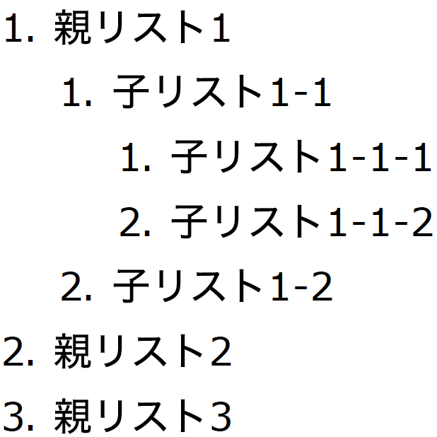
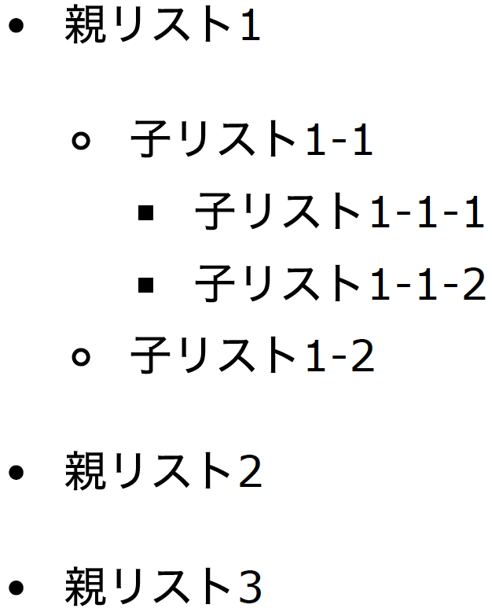
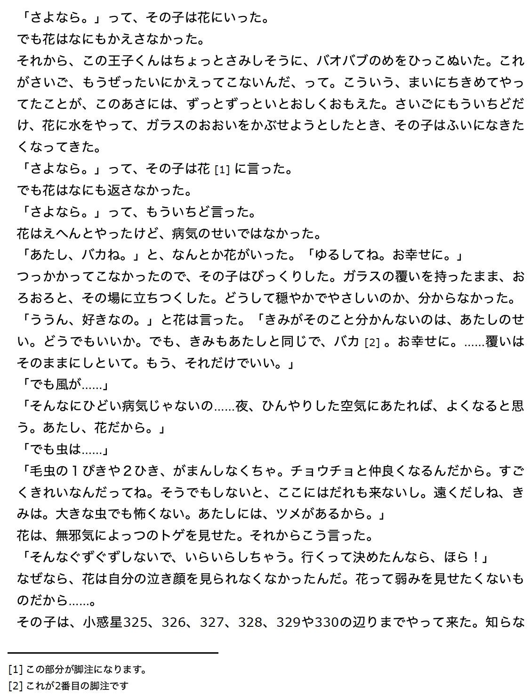
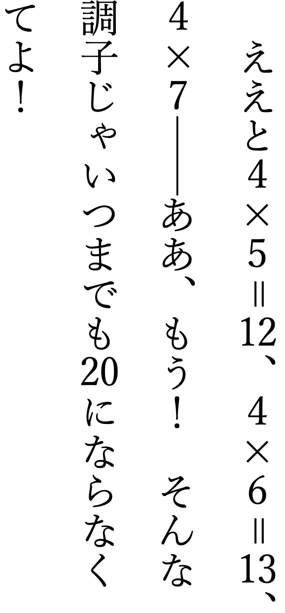
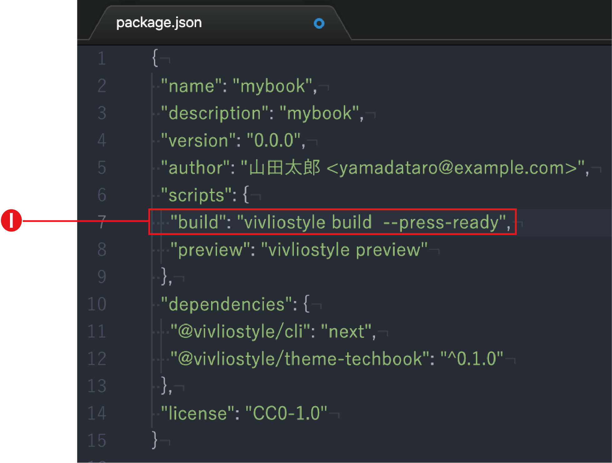

# Create Bookで同人誌を作ろう！

<div class="draft-author">
小形克宏 (一般社団法人ビブリオスタイル)
</div>

Create Book^[https://github.com/vivliostyle/create-book] は markdownで書いた原稿をCSS組版して、簡単にPDFファイルへ変換する環境を構築します。HTMLやCSSの詳しい知識はいりません。ルビや画像や表組、後注も入れられますし、複数の原稿をまとめることだってOK。詳細はチュートリアルガイド^[https://docs.vivliostyle.org/#/ja/create-book]を参照していただくとして、この記事では、手っ取り早く「Create Bookでできること」を紹介します。さあ、あなたも Create Book で同人誌を作りませんか？

## Create Book を使うには

1. まず Node.js (v.10以上)^[https://nodejs.org/ja/] をインストールしてください。
2. Create Book のインストールコマンドは下記の通りです。`<directory>` には作成しようとする本のプロジェクトフォルダ名を指定します。

`npm create book <directory>`

3. インストールの際、作りたい本の用途に合わせ以下のテーマパッケージのいずれかを指定します
    1. `@vivliostyle/theme-bunko`……小説同人誌をふくむ縦書き文書／冊子
    2. `@vivliostyle/theme-techbook`……技術同人誌をふくむ横書き冊子
    3. `@vivliostyle/theme-slide`……スライド
    4. `@vivliostyle/theme-academic`……論文、レポートをふくむ横書き文書
4. インストールすると下図のようなフォルダ (ここでは `mybook`) が作成されます。❶〜❸のファイルを編集することで、本作りをすすめます。


## VFM で原稿を書いてみよう

インストールにより作られたフォルダ内の `manuscript.md` (図1❶)をテンプレートとして編集することで、本作りのための原稿を作成します。このファイルはmarkdown形式。これは一定の記法 (ルール) で書くことにより、プレーンテキストから簡単にHTMLへ変換できるフォーマットです。

もともとmarkdown はブログの原稿を書くために考案された形式です。ここから分かるように、その魅力は「原稿として書けること」、そして「HTMLに変換できること」の2つです。原稿を最初からHTMLで書く人はほとんどいないでしょう。しかし markdown形式ならそれができます。プレーンテキストの書きやすさと、HTML の利便性の両立を狙ったフォーマットが markdown なのです。

markdown には各種の方言がありますが、その中でもっとも有力なのが GFM (GitHub Flavored Markdown)^[https://github.github.com/gfm/] です。ただし、これは技術ドキュメント向けに工夫された記法なので、日本語書籍向けの記法を追加したのが VFM (Vivliostyle Flavored Markdown)^[https://github.com/vivliostyle/vfm] です。

つまり、VFM は GFM の上位互換です。見出しなどよく使う記法は GFM のままですから、慣れた人ならあまり苦労せずに使い始めることができるでしょう。以下、この項では「VFM を使ってなにが書けるの？」という疑問にお答えします。

### GFMの記法

基本となるGFM の主な記法をご紹介しましょう。これ以外にもたくさんの記法があります。詳細はチュートリアルガイドや、GitHubの解説ページ^[https://docs.github.com/ja/github/writing-on-github/basic-writing-and-formatting-syntax]を参照してください。

#### 見出し

##### VFMでの記述

```
    # Heading text(1段階の見出し)
    ## Heading text(2段階の見出し)
    ### Heading text(3段階の見出し)
    #### Heading text(4段階の見出し)
    #### Heading text(4段階の見出し)
    ### Heading text(3段階の見出し)
    ### Heading text(3段階の見出し)
    ## Heading text(2段階の見出し)
    # Heading text(1段階の見出し)
```
##### HTMLへの変換結果への変換結果

```
    <section id="heading-text1段階の見出し">
    <h1>Heading text(1段階の見出し)</h1>
    <section id="heading-text2段階の見出し">
    <h2>Heading text(2段階の見出し)</h2>
    <section id="heading-text3段階の見出し">
    <h3>Heading text(3段階の見出し)</h3>
    <section id="heading-text4段階の見出し">
    <h4>Heading text(4段階の見出し)</h4>
    </section>
    <section id="heading-text4段階の見出し-1">
    <h4>Heading text(4段階の見出し)</h4>
    </section>
    </section>
    <section id="heading-text3段階の見出し-1">
    <h3>Heading text(3段階の見出し)</h3>
    </section>
    <section id="heading-text3段階の見出し-2">
    <h3>Heading text(3段階の見出し)</h3>
    </section>
    </section>
    <section id="heading-text2段階の見出し-1">
    <h2>Heading text(2段階の見出し)</h2>
    </section>
    </section>
    <section id="heading-text1段階の見出し-1">
    <h1>Heading text(1段階の見出し)</h1>
```

##### PDFファイルへの出力結果


#### リスト (順序なし)

##### VFMでの記述

```
    - 親リスト1
        - 子リスト1-1
            - 子リスト1-1-1
            - 子リスト1-1-2
        - 子リスト1-2
    - 親リスト2
    - 親リスト3
```

##### HTMLへの変換結果

```
    <ul>
      <li>親リスト1
        <ul>
          <li>子リスト1-1
            <ul>
              <li>子リスト1-1-1</li>
              <li>子リスト1-1-2</li>
            </ul>
          </li>
          <li>子リスト1-2</li>
        </ul>
      </li>
      <li>親リスト2</li>
      <li>親リスト3</li>
    </ul>
```

##### PDF ファイルへの出力結果




#### リスト (順序あり)

##### VFMでの記述

```
    1. 親リスト1
        1. 子リスト1-1
            1. 子リスト1-1-1
            2. 子リスト1-1-2
        2. 子リスト1-2
    2. 親リスト2
    3. 親リスト3
```

##### HTMLへの変換結果

```
    <ol>
      <li>親リスト1
        <ol>
          <li>子リスト1-1
            <ol>
              <li>子リスト1-1-1</li>
              <li>子リスト1-1-2</li>
            </ol>
          </li>
          <li>子リスト1-2</li>
        </ol>
      </li>
      <li>親リスト2</li>
      <li>親リスト3</li>
    </ol>
```

##### PDF ファイルへの出力結果




#### リンク

##### 記法

`[text](url)`

##### VFMでの記述


`[Vivliostyle](https://vivliostyle.org)`


##### HTMLへの変換結果


`<a href="https://vivliostyle.org">Vivliostyle</a>`


##### PDF ファイルへの出力結果


#### 強調

##### 記法

`**text**`

##### VFMでの記述

 `**なんて太い強調だ**`

##### HTMLへの変換結果


`<strong>なんて太い強調だ</strong>`


##### PDF ファイルへの出力結果


### GFMを拡張する記法

GFM では書けない、VFM の拡張記法をご紹介します。いずれも技術ドキュメントには必須でなくとも、日本語書籍では不可欠な表現ばかりです。

#### ルビ

##### 記法

`{漢字|ルビ}`

##### VFMでの記述

`{振|ふ}り{仮名|がな}が使えます。`

##### HTMLへの変換結果

```
    <ruby>振
      <rt>ふ</rt>
    </ruby>り
    <ruby>仮名
      <rt>がな</rt>
    </ruby>が使えます。
```

##### PDF ファイルへの出力結果


#### 画像のサイズとキャプション

##### 記法

`{width=nnn}`

画像ファイルは( )内に相対パスで指定します。xxxは数値、単位はpxですが省略して記述します。`width` (幅) の他に `height` (高さ) も使えます。

##### VFMでの記述


`{width=1500}`


##### HTMLへの変換結果

```
    <figure>
      
      <figcaption>VFMならキャプションも書けます。画像のサイズは幅1500pxです。</figcaption>
    </figure>
```

##### PDF ファイルへの出力結果


#### 後注

##### 記法

```
    text[^n]text^[text]

    [^n]: text
```

##### VFMでの記述

```
    朝、食堂でスウプを一さじ[^1]、すっと吸ってお母さまが、「あ」と幽かな叫び声^[本文の中に書いた注記を後注にすることもできます]をお挙げになった。

    [^1]:このように後注が使えます。
```

##### HTMLへの変換結果

```
    <p>朝、食堂でスウプを一さじ
      <sup id="fnref-1">
        <a href="#fn-1" class="footnote-ref">1</a>
      </sup>、すっと吸ってお母さまが、「あ」と幽かな叫び声
      <sup id="fnref-2">
        <a href="#fn-2" class="footnote-ref">2</a>
      </sup>をお挙げになった。
    </p>
    </section>
    </section>
    <div class="footnotes">
    <hr>
    <ol>
      <li id="fn-1">このように後注が使えます。
        <a href="#fnref-1" class="footnote-backref">↩</a>
      </li>
      <li id="fn-2">本文の中に書いた注記を後注にすることもできます
        <a href="#fnref-2" class="footnote-backref">↩</a>
      </li>
    </ol>
```

##### PDF ファイルへの出力結果


#### 脚注

インストールの際にテーマパッケージ `@vivliostyle/theme-techbook`を選択した場合、以下の記法で脚注を使えます。

##### 記法

```
    <span class="footnote">footnote text</span>
```

##### VFMでの記述

```
    「さよなら。」って、その子は花<span class="footnote">この部分が脚注になります。</span>に言った。
    　でも花はなにも返さなかった。
    「さよなら。」って、もういちど言った。
    　花はえへんとやったけど、病気のせいではなかった。
    「あたし、バカね。」と、なんとか花がいった。「ゆるしてね。お幸せに。」
    　つっかかってこなかったので、その子はびっくりした。ガラスの覆いを持ったまま、おろおろと、その場に立ちつくした。どうして穏やかでやさしいのか、分からなかった。
    「ううん、好きなの。」と花は言った。「きみがそのこと分かんないのは、あたしのせい。どうでもいいか。でも、きみもあたしと同じで、バカ<span class="footnote">これが2番目の脚注です</span>。お幸せに。……覆いはそのままにしといて。もう、それだけでいい。
```

##### HTMLへの変換結果

```
    「さよなら。」って、その子は花
    <span class="footnote">この部分が脚注になります。</span>に言った。
    <br>でも花はなにも返さなかった。
    <br>「さよなら。」って、もういちど言った。
    <br>花はえへんとやったけど、病気のせいではなかった。
    <br>「あたし、バカね。」と、なんとか花がいった。「ゆるしてね。お幸せに。」
    <br>つっかかってこなかったので、その子はびっくりした。ガラスの覆いを持ったまま、おろおろと、その場に立ちつくした。どうして穏やかでやさしいのか、分からなかった。
    <br>「ううん、好きなの。」と花は言った。「きみがそのこと分かんないのは、あたしのせい。どうでもいいか。でも、きみもあたしと同じで、バカ
    <span class="footnote">これが2番目の脚注です</span>。お幸せに。……覆いはそのままにしといて。もう、それだけでいい。」
```

##### PDF ファイルへの出力結果



この他にも、引用やコード、表組みなど、さまざまな表現が可能です。ぜひチュートリアルガイドやGitHubの解説ページをご参照ください。


#### 縦中横

Creat Bookは、インストールの際テーマパッケージ `@vivliostyle/theme-bunko` を選択すると縦書きになります。その際、下記のようにHTMLにより縦中横を指定することができます。

##### 記法

```
    text<span class="tcy">nn</span>text
```

##### VFMでの記述

```
    ええと<span class="tcy">4</span>×<span class="tcy">5</span>＝<span class="tcy">12</span>、<span class="tcy">4</span>×<span class="tcy">6</span>＝<span class="tcy">13</span>、<span class="tcy">4</span>×<span class="tcy">7</span>——ああ、もう！　そんな調子じゃいつまでも<span class="tcy">20</span>にならなくてよ！
```

##### HTMLへの変換結果

```
    <p>ええと
      <span class="tcy">4</span>×
      <span class="tcy">5</span>＝
      <span class="tcy">12</span>、
      <span class="tcy">4</span>×
      <span class="tcy">6</span>＝
      <span class="tcy">13</span>、
      <span class="tcy">4</span>×
      <span class="tcy">7</span>——ああ、もう！　そんな調子じゃいつまでも
      <span class="tcy">20</span>にならなくてよ！
    </p>
```

##### PDF ファイルへの出力結果



## Create Book でPDFファイルを出力しよう

### 本のカスタマイズ

原稿が完成したら本を作ってみましょう。Create Book は以下のようにCSS組版した後、自動的にPDFファイルを出力します。

1. markdownファイルをHTMLに変換
2. それをVivliostyle CLIが、`vivliostyle.config.js` (図1❷) の設定に従い組版
3. さらに `package.json` (図1❸) の設定に従い、PDFファイルに出力

作りたい本の大まかな用途や造本イメージは、インストール時にテーマパッケージを選択することで決定しましたが、さらに細かな設定を `vivliostyle.config.js` や `package.json` を編集することでおこなう訳です。複数の原稿を1冊にまとめたり、目次、奥付を追加する設定もここでおこないます。

#### vivliostyle.config.js (図1❷)の編集


- 🅐書名の指定^[https://docs.vivliostyle.org/#/ja/create-book#%E6%9B%B8%E5%90%8D%E3%81%AE%E6%8C%87%E5%AE%9A]
- 🅑著者名とメールアドレスの指定^[https://docs.vivliostyle.org/#/ja/create-book#%E8%91%97%E8%80%85%E5%90%8D%E3%81%A8%E3%83%A1%E3%83%BC%E3%83%AB%E3%82%A2%E3%83%89%E3%83%AC%E3%82%B9%E3%81%AE%E6%8C%87%E5%AE%9A]
- 🅒使用言語の指定^[https://docs.vivliostyle.org/#/ja/create-book#%E4%BD%BF%E7%94%A8%E3%81%99%E3%82%8B%E8%A8%80%E8%AA%9E%E3%81%AE%E6%8C%87%E5%AE%9A]
- 🅓判型の指定^[https://docs.vivliostyle.org/#/ja/create-book#%E5%88%A4%E5%9E%8B%E3%81%AE%E6%8C%87%E5%AE%9A]
- 🅔テーマパッケージの指定^[https://docs.vivliostyle.org/#/ja/create-book#%E3%83%86%E3%83%BC%E3%83%9E%E3%83%95%E3%82%A1%E3%82%A4%E3%83%AB%E3%81%AE%E6%8C%87%E5%AE%9A]
- 🅕目次の追加^[https://docs.vivliostyle.org/#/ja/create-book#%E7%9B%AE%E6%AC%A1%E3%81%AE%E8%BF%BD%E5%8A%A0]
- 🅖複数原稿の掲載^[https://docs.vivliostyle.org/#/ja/create-book#%E8%A4%87%E6%95%B0%E5%8E%9F%E7%A8%BF%E3%81%AE%E6%8E%B2%E8%BC%89]
- 🅗奥付の追加^[https://docs.vivliostyle.org/#/ja/create-book#%E5%A5%A5%E4%BB%98%E3%81%AE%E8%BF%BD%E5%8A%A0]

#### package.json(図1❸)の編集



- 🅘4色印刷用PDFファイル の生成^[https://docs.vivliostyle.org/#/ja/create-book#4%E8%89%B2%E5%8D%B0%E5%88%B7%E7%94%A8pdf%E3%83%95%E3%82%A1%E3%82%A4%E3%83%AB-%E3%81%AE%E7%94%9F%E6%88%90]

### PDFファイルの出力

以下のコマンドにより、Vivliostyle CLI が上記設定ファイルを読み込み、自動的にPDFファイルを出力します。これで完成です！

`npm run build`

より詳細は以下をご参照ください。

-本の生成 ^[https://docs.vivliostyle.org/#/ja/create-book#%E6%9C%AC%E3%81%AE%E7%94%9F%E6%88%90]


以上、駆け足でCreate Bookをご紹介しました。このページの情報はあくまで一部、より詳しいことはぜひチュートリアルガイドを読んでみてください。それから、Create Bookはまだまだ開発途上。「これって不具合？」「こんなことができればいい！」などありましたら、ぜひ下記からお知らせください！

- コミュニティ[Vivliostyle]^[https://vivliostyle.org/ja/community/]
