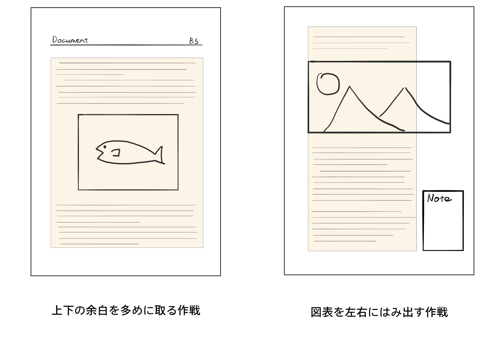

# CSS で技術系同人誌のレイアウトを作る際に気をつけていること

<div class="draft-author">
spring-raining
</div>

はじめましてこんにちは、spring-raining です。vivliostyle-cli のバージョンアップや create-book の登場で、Vivliostyle がさらに始めやすくなり CSS 組版のハードルも最近ではぐっと下がりました！ テーマ機能の登場で、もはや CSS を書かなくてもいい感じに出力してくれるようになりましたが、ここではもう少し踏み込んで CSS を書きたくなった人のための tips を紹介します。

先にお断りしておきますが、あくまで CSS 以外に関しては素人の意見なので、オシャレな組版や正しいデザイン論についての紹介ではないです。個人の意見としてお楽しみいただけると幸いです。

## 基本的なレイアウト

まず `line-height` や `letter-spacing` などの行間、文字間のような基礎的なレイアウトの指定は、基本的に Web の指定をそのまま流用してよいと（素人の目からは）感じています。ただし、フォントによって一行の高さは異なるので、使いたいフォントを CSS で表示させたあと、ディスプレイを見て読みやすいと感じる `line-height` を指定します。こうして設定した行間は、紙でも問題なく通用します。

長い文章を読みやすくするために、左右に余白を設けて適切な行の長さにする必要がありますが、これもブラウザ上で読みやすい行の長さをつかむと良いです。

では、ブラウザ上で読みやすいレイアウトはどのように決めるのでしょうか？ この問いを解決してくれるそのものズバリな本 “ウェブタイポグラフィ” <span class="footnote">リチャード・ラター (著), 鈴木丈 (監訳), “ウェブタイポグラフィ─美しく効果的でレスポンシブな欧文タイポグラフィの設計”, 2020.</span> が最近発売されました。おすすめなのでぜひ読んでみてください（ダイマ）

### 紙向けの `font-size` の設定

文字の大きさは、ディスプレイと紙では意外と感覚的な違いが大きく、原寸のまま PDF に出力するとかなり文字が大きく感じます。この問題に対しては、以下のように一括でフォントサイズを設定してしまうと便利です。

```css
@media print {
  :root {
    font-size: 75%;
  }
}
```

このとき、root 要素に適用しないと `rem` で指定されたプロパティにサイズの変更が適用されないので、必ず `html` や `:root` で設定します。

### `palt` の使い所

フォントにはプロポーショナルメトリクスと呼ばれる情報が含まれており、ある環境ではこの情報に基づいて文字詰めを適用してくれます。ブラウザでは、以下のような隠しコマンドめいた CSS によりプロポーショナルメトリクスを有効化できます。

```css
font-feature-settings: "palt";
```

この設定は、一時期あらゆる箇所で有効化していましたが、この判断は間違いでした。文字詰めを適用したテキストは見た目には美しいものの、文字間が詰まって見えるため本文では読みづらさにつながってしまいます。また、これを解決しようと `letter-spacing` を設定すると、今まで適切だった文字まで間隔が開いてしまい更に読みにくくなりました。そのため、`@vivliostyle/theme-techbook` では見出し（`h1, h2, h3`）にのみ適用しています。

## 同人誌の紙面サイズと技術書の相性

同人誌特有の事情として、B5 や A5 といった紙面サイズが固定されがちという点があります。技術系の書籍に限ると、お手元のオライリーの本などと比べてみるとだいぶ縦長であることに気づくと思います。これは、技術書などでは A 版・B 版と比べて横長のレターサイズを使う例があるためです。


そのため、これらの本を参考にして行数や余白を設定してしまうと、いざ完成して本を読んだ際に妙に縦長に感じてしまうかもしれません。また、個人的な感覚ではありますが、ソースコードの入り交じるような内容では、横幅の狭さを感じさせないレターサイズのほうが読みやすく感じました。この違和感を解消させるためには、以下のような解決策が考えられます。

**上下の余白を広めにとる・デザインでごまかす**
相対的に左右方向のサイズを広げる最も簡単な方法です。上下の余白が気になる際は、線などを引いて視覚的に余白を切り取るという手もあります。本書の上辺は 2cm ほど黒く塗りつぶされていますが、この効果を狙ってつけたものです。

**本文の行の長さを狭めて図やソースコードを幅広にとる**
ちょっと凝ったレイアウトでは、上記の方法とは逆に左右の余白が広く取られているものがあります。その代わり、横幅を広く取る必要がある図やソースコードは、この余白にはみ出して配置させます。これにより、見かけより横に広く見えるという効果があります。さらに、この余白に傍注（注釈）があったりするとカッコいいですね！

**紙の短辺を断ち切って変形サイズにしてしまう**
もしくは、思い切って本の断ち切ってみるのはどうでしょうか。私も一度 B5 を横に断ち切り正方形の本を作ってみたことがありますが、無理なく二段組が組めてとても新鮮でした。また、他のオプションと比べて変形裁断はそれほど値段が高くない印象です。



## 図はコントラストを強く、線は細く濃く

特に黒の一色刷りで気をつけなければいけないのは、ディスプレイ向けに作った図はグレースケールで印刷すると見づらくなる事がある点です。ディスプレイ上の図表と比べて、以下のような傾向がありました。

### 色の差に鈍感になる

グレースケールなので当たり前ですが、特に明度の近い色の区別は想像以上に難しくなります。明るい色の上に白文字がないか、暗い色の上に黒文字がないかに注意します。

### 細さ・太さに敏感になる

逆に、黒色（#000000）で印刷される矢印や罫線は、ディスプレイよりも視認性が高いです。画面では細すぎるような線も、紙に印刷されるとはっきりと見えるようになります。例えば、2 種類の矢印を色で区別するような図では、それぞれの線の色だけでなく線の太さでバリエーションを付けるとより見やすいです。

言い方を変えれば、ディスプレイ用に作った図の線は太く見られてしまう事が多いです。図表の線は本文と同じ黒色を使い、線の太さはいつもより細めに設定することがコツです。

### CSS で細い border を書くテクニック

ところで、CSS の `border` は 1px よりも細い線を設定できないことが知られていますが、細めの線を引きたいときは 1px でもまだ太いと感じることが多いと思います。ところが、`box-shadow` の機能を使うことで、擬似的に 1px 以下の線を表示させることができます。

```css
/* 横に0.5pxの線を引く */
hr {
  box-shadow: 0 1px 0 -0.5px currentColor;
}
```

なお、Web 上で検索するとこの方法以外にも `transform` を使って border の幅を狭める方法が紹介されています。ちょっと説明は難しいのですが、この方法はディスプレイ上での見た目は同じであるものの、ブラウザの内部的にはラスタライズ処理を経ており異なる手段で実現しています。そのため PDF に出力する際は、`box-shadow` を使った方法が最終的な出力結果としては良くなります。

## ハイパーリンクの有無によるテキストの変化

今までの見た目とは違う話にはなりますが、Web と書籍での大きな違いの一つがハイパーリンクの有無です。紙のテキストにリンクを張ることはもちろんできないので、不足する情報をリンクの URL や補足説明を脚注などの形で追加する必要があります。しかし、ただ機械的に URL を挿入するだけでは読みにくくなるだけなので、難しいところです。

現在はこの問題に対して手作業で文章を修正していますが、もし Web と紙両方で成り立つようなマークアップにするなら、こんな感じで印刷時にのみに現れる補足用のテキストを含めるのは有効そうです。

```css
@media screen {
  .print-only-text {
    font-size: 0;
  }
}
```

ただこれも手作業で書き換えることには変わりないのが残念です。Web の内容をそのまま紙に印刷するだけではなく、こういった面も地道に修正してワンランク上の完成度にしていきたいですね！

## まとめ

CSS は長年 Web の表現力を向上させることを目標に、発展を続けてきた歴史があります。その技術をすべて取り入れられる CSS 組版は、手軽に自分の思い通りの組版を実現するのに最適です。ぜひ自分好みのレイアウト作りに CSS を使ってみてください！
