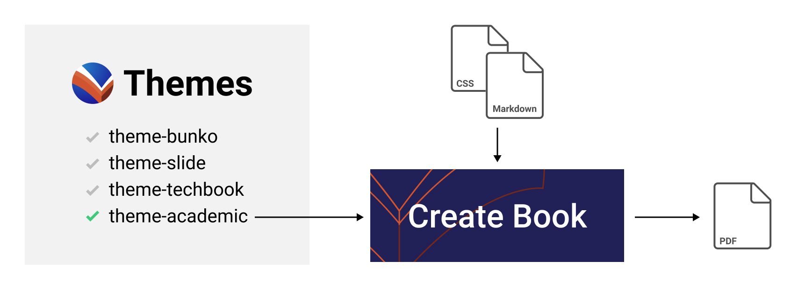
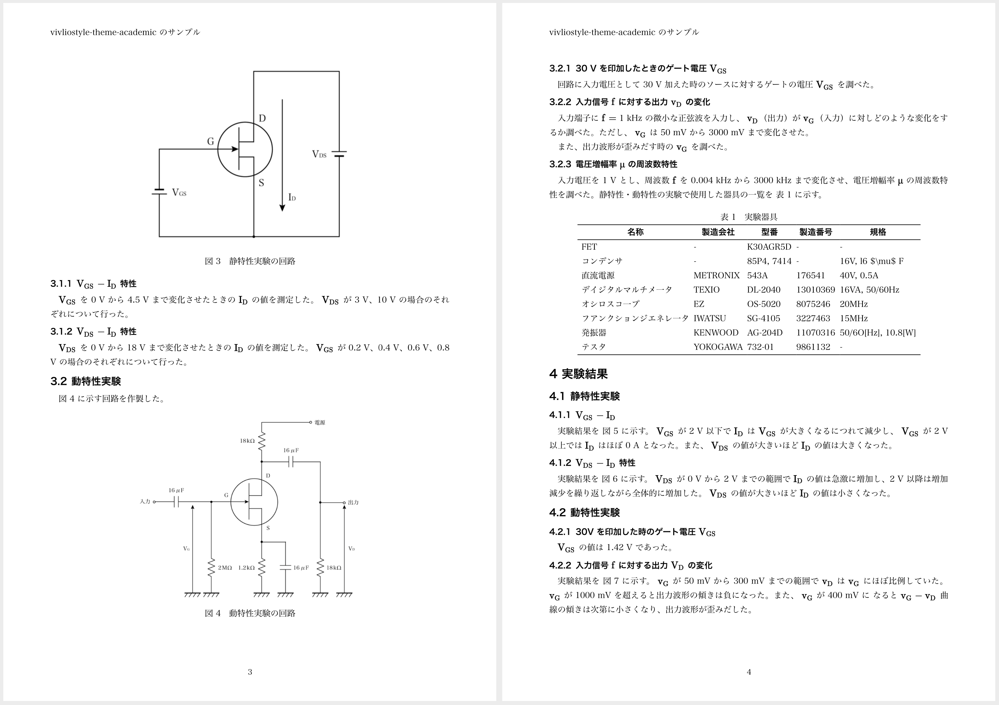
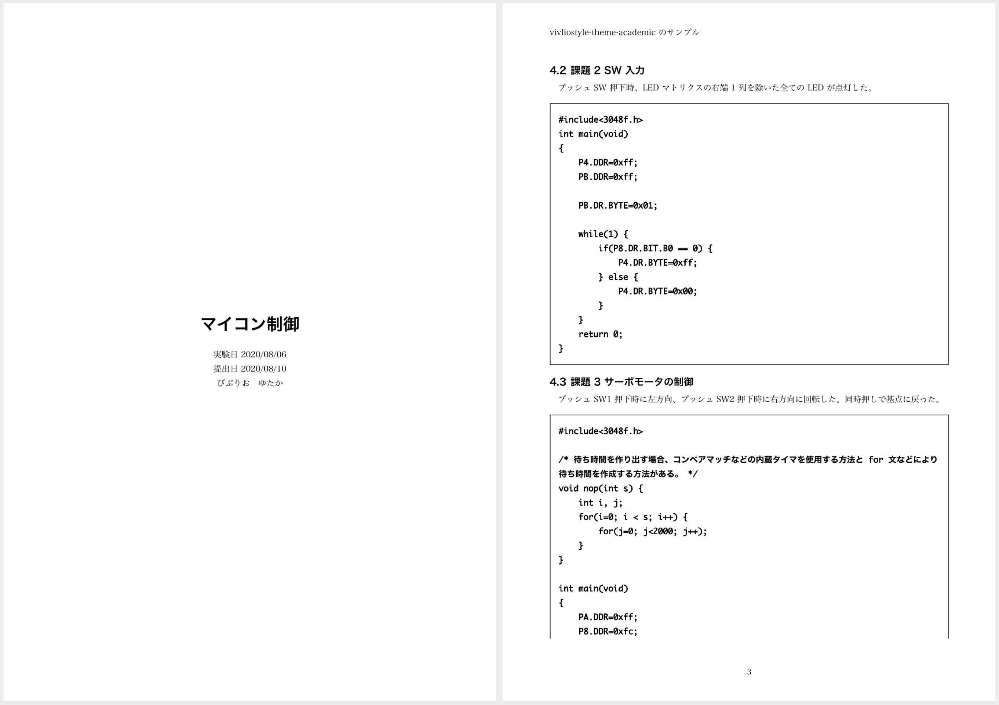
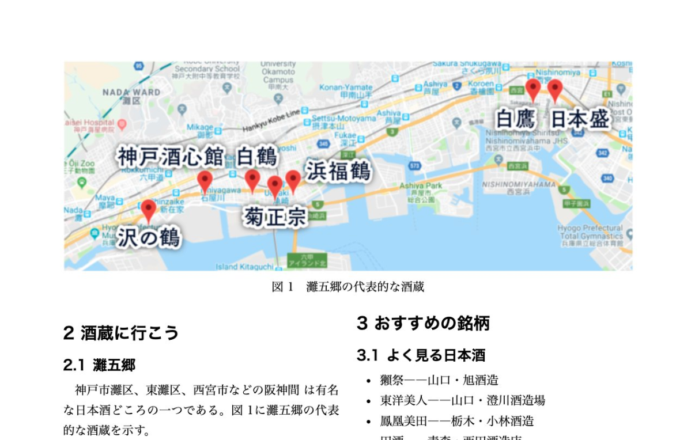

# @vivliostyle/theme-academic でレポート書いてみた！

<div class="draft-author">
やましー
</div>

本稿は、[@vivliostyle/theme-academic](https://github.com/vivliostyle/themes/tree/master/packages/%40vivliostyle/theme-academic) を使えば Vivliostyle でアカデミックな文書も作れちゃうよ！　ということをお伝えするものです。

## はじめに
こんにちは、[やましー](https://twitter.com/yamasy1549)といいます。毎日課題レポートに追われる学生をしています。ちょうど本稿の執筆締め切りと種々のレポート提出締め切りが重なっていて、さっきまでｱﾜｱﾜしていたところです。

Vivliostyle ユーザー歴は 3 年くらいです。過去の同人誌[『Vivliostyle で本を作ろう Vol.1』](https://vivliostyle.github.io/vivliostyle_doc/ja/vivliostyle-user-group-vol1/) では[『CSS 組版やってみた！』](https://vivliostyle.github.io/vivliostyle_doc/ja/vivliostyle-user-group-vol1/yamasy/index.html)という題で、Vivliostyle を使って同人誌や卒論を書いた際の tips などを紹介しました。そのご縁もあって、このたび [Create Book](https://vivliostyle.org/ja/make-books-with-create-book/) のデフォルトテーマのひとつである [@vivliostyle/theme-academic](https://github.com/vivliostyle/themes/tree/master/packages/%40vivliostyle/theme-academic)（以下、theme-academic）を作りました。本稿では、theme-academic を使ってアカデミックな文書を作成する方法を紹介します。

## theme-academic で何ができる？
### サンプルはこんな感じ
theme-academic は、Vivliostyle でアカデミックな文書を作るためのスタイルテーマです。現状、Create Book というツールを通して使うことができます。

{#fig-a230c7c4-ab76-4fe7-a47c-fcdaf37ccb94}

theme-academic では、Markdown で構造化された文書を書くだけでいい感じにレポートらしい PDF が出力できることを目指しています。サンプルをいくつか紹介しましょう。

{.fig #fig-c09197af-5aea-4151-86e4-cd2f8105ce39}

{.fig #fig-39de9443-ad8d-4f2b-a1f9-86eacd79c53c}

こんなレポートが CSS 組版で書けるなんてわくわくしますね！　特に表のスタイルなんかはこだわり甲斐がありそうです。では、実際にレポートを書いて自分好みにカスタマイズしてみましょう。

### サンプルのレポートをビルドしてみよう
以下の環境を仮定します。
- Node.js: v14.8.0
- @vivliostyle/core: 2.1.1
- @vivliostyle/cli: 3.0.0-pre.3
- @vivliostyle/vfm: 1.0.0-alpha.10
- @vivliostyle/theme-academic: 0.2.0

まずは Create Book を使ってプロジェクトを作りましょう。簡単は流れは次の通りです。詳細は [『特集企画：Create Book で同人誌を作ろう！』の『Create Book を使うには』の章](https://vivliostyle.org/ja/make-books-with-create-book/#Create%20Book%20%E3%82%92%E4%BD%BF%E3%81%86%E3%81%AB%E3%81%AF)を参考にしてください。
1. `npm create book お好きなプロジェクト名`
2. テーマは `@vivliostyle/theme-academic` を選択

"Happy writing!" と出てプロジェクトが作成できたら、サンプルのレポートをビルドして PDF を作ってみましょう。vivliostyle.config.js の `entry` の部分を以下のように変更して `yarn build` すると、先程のスクショと同じ PDF が生成されているはずです。

```js:vivliostyle.config.js
entry: [
    // サンプルのレポート
    'node_modules/@vivliostyle/theme-academic/example/microcomputer.md',
],
```

余談ですが、`yarn preview` で立ち上がる Chromium の印刷機能で生成した PDF は、文字の選択とコピーなどができないようです。自分はこれを知らないままレポートを出して教員を苦しめてしまった実績があります……。`yarn build` で作られた PDF は文字が選択できます。

### サンプルで学ぶ、基本の使い方
theme-academic では、レポートを書く際に必要と思われる基本的な要素をサポートしています。以下の表はその一例です。具体的な記法は[サンプルのレポート（マークダウンで書かれたもの）](https://github.com/vivliostyle/themes/blob/master/packages/@vivliostyle/theme-academic/example/microcomputer.md)をご覧ください。VFM の記法は https://vivliostyle.github.io/vfm/#/vfm にまとまっています。

:::wide-table

| 基本的な要素 | 記法 | 出力（PDF） |
| --- | --- | --- |
| 見出し | GFM 準拠。`.nocounter` でカウンタを削除（[例](https://github.com/vivliostyle/themes/blame/700d2567bd232b697f2935c95f174548f7cbc46c/packages/%40vivliostyle/theme-academic/example/fet.md#L182-L187)） |  |
| 箇条書き | GFM 準拠。`ol.nostyle` `ul.nostyle` で箇条書きの記号を削除 |  |
| 参考文献リスト | `ol.reference` に HTML をそのまま書く（[例](https://github.com/vivliostyle/themes/blame/700d2567bd232b697f2935c95f174548f7cbc46c/packages/%40vivliostyle/theme-academic/example/fet.md#L189-L194)） |  |
| 図 | [VFM 準拠](https://vivliostyle.org/ja/make-books-with-create-book/#%E7%94%BB%E5%83%8F%E3%81%AE%E3%82%B5%E3%82%A4%E3%82%BA%E3%81%A8%E3%82%AD%E3%83%A3%E3%83%97%E3%82%B7%E3%83%A7%E3%83%B3)（[例](https://github.com/vivliostyle/themes/blame/700d2567bd232b697f2935c95f174548f7cbc46c/packages/%40vivliostyle/theme-academic/example/fet.md#L42)） |  |
| 表 | 表キャプションが未実装のため、HTML をそのまま書く（[例](https://github.com/vivliostyle/themes/blame/700d2567bd232b697f2935c95f174548f7cbc46c/packages/%40vivliostyle/theme-academic/example/fet.md#L66-L105)）。キャプション無しなら GFM 準拠 |  |
| 参考文献・図表カウンタの参照 | VFM で仕様が決まっていないため、参照<span style="font-family: body">元</span>に `<a href="#id" data-ref="fig"></a>`、参照先に `<span id="id"></span>` を書くことで代用（[例](https://github.com/vivliostyle/themes/blame/700d2567bd232b697f2935c95f174548f7cbc46c/packages/%40vivliostyle/theme-academic/example/fet.md#L25-L35)） |  |
| 後注 | [VFM 準拠](https://vivliostyle.org/ja/make-books-with-create-book/#%E5%BE%8C%E6%B3%A8) |  |
| 右・中央・左寄せ | `.right` `.center` `.left` |  |
| 数式 | KaTeX の記法が使える（[例](https://github.com/vivliostyle/themes/blame/700d2567bd232b697f2935c95f174548f7cbc46c/packages/%40vivliostyle/theme-academic/example/fet.md#L155-L157)） |  |
| ソースコード | prism.js を使用（[例](https://github.com/vivliostyle/themes/blame/700d2567bd232b697f2935c95f174548f7cbc46c/packages/%40vivliostyle/theme-academic/example/microcomputer.md#L77-L101)） |  |
| 囲み | `.frame`（[例](https://github.com/vivliostyle/themes/blame/700d2567bd232b697f2935c95f174548f7cbc46c/packages/%40vivliostyle/theme-academic/example/microcomputer.md#L75-L103)） |  |
| タイトル下の著者情報など | `.author` 内に箇条書き（[例](https://github.com/vivliostyle/themes/blame/700d2567bd232b697f2935c95f174548f7cbc46c/packages/%40vivliostyle/theme-academic/example/fet.md#L7-L10)） |  |
| ヘッダー・フッターのテキスト | SCSS の `$page-top-left` などの変数で指定。後述 |  |
| 表紙の有無 | SCSS の `$cover` 変数で指定。`section.cover` 要素が表紙になり、表紙はページ番号がつかない（[例](https://github.com/vivliostyle/themes/blame/700d2567bd232b697f2935c95f174548f7cbc46c/packages/%40vivliostyle/theme-academic/example/microcomputer.md#L5-L17)）。後述 |  |

:::

### スタイルをカスタマイズしよう
公式テーマのスタイルをどのようにカスタマイズすべきかは [How to customize the style of themes? #9](https://github.com/vivliostyle/themes/issues/9) で目下議論中ですが、現状できる筋肉解決的な方法のひとつに、テーマで使っている SCSS ファイルを編集する方法があります。面倒ですが、package.json と vivliostyle.config.js を以下のように変更し、`yarn dev` で SCSS ファイルをトランスパイルすればスタイルをカスタマイズできます。
```
$ yarn add node-sass npm-run-all
```
```json:package.json
"scripts": {
    "build": "vivliostyle build",
    "dev": "run-p preview watch:scss",
    "preview": "vivliostyle preview",
    "watch:scss": "node-sass node_modules/@vivliostyle/theme-academic/scss/main.scss custom.css -w -r -q --source-map true --output-style expanded"
}
```
```js:vivliostyle.config.js
theme: 'custom.css'
```

たとえば node_modules/@vivliostyle/theme-academic/scss/variables.scss で定義された変数の値を書き換えることで、たとえば以下のようなカスタマイズができます。

| 変数名 | 効果 |
| --- | --- |
| `$font-serif` `$font-sans-serif` `$font-monospace` | セリフ体・サンセリフ体・ソースコードのフォント |
| `$page-width` `$page-height` `$page-margin-top` | レポートのサイズ・余白 |
| `$body-font-size` `$body-line-height` | 本文のフォントサイズ・行高さ |
| `$page-top-left` など | ヘッダー・フッターのテキスト |
| `$cover` | 表紙の有無。`true` の場合は `section.cover` が表紙になり、表紙にはページ番号がつかない |

## ここがまだだよ theme-academic
theme-academic はまだ作られたばかりで、できないこともたくさんあります。以下はその一部です。
- 独立した目次ページ
- レポートにありがちな行数文字数指定ができない。横幅と縦幅から自分で `line-height` と `font-size` を算出する必要があります……
- 2 段組み。theme-academic-twocolumn というテーマを近日中に公開する予定です。次のスクショのように、段抜きもできるようになります

{#fig-dc546b4c-b504-44ff-8afe-608432241fc8}

また、VFM の仕様に起因する問題もあります。
- キャプションに VFM 記法が使えない
- カウンタ参照の記法がまだない

不便なことがあれば、是非 [vivliostyle/theme](https://github.com/vivliostyle/themes/issues) や [vivliostyle/vfm](https://github.com/vivliostyle/vfm/issues) にご意見をお寄せください。より便利なレポート生活のために、theme-academic を充実させていけたらと思っています。今後は、学会・学術誌指定のスタイルを適用したテーマを作ってみるのも良さそうですね。

## おわりに
本稿では、[@vivliostyle/theme-academic](https://github.com/vivliostyle/themes/tree/master/packages/%40vivliostyle/theme-academic) を使って Vivliostyle でレポートが書けることを紹介しました。この CSS 組版の利点は、生テキストなので差分をとりやすく Git で管理しやすいことと、スタイルを自分好みにいじりやすいことだと思っています。他にも、場合によってはワープロソフトで作った文書よりもサイズが小さく済むかもしれませんし、同時に HTML も出力されるので、PDF 形式だけでなく Web ページとしても公開したいケースでは大変うれしいですね。個人的には論文を固定サイズの PDF で読むのはしんどいので、HTML 形式の論文を好きなブラウザ幅で読めるような流れになっていけばいいのになぁと願っています。

上でも述べましたが、theme-academic はまだ生まれたてです。使ってみた感想や意見などを [vivliostyle/theme](https://github.com/vivliostyle/themes/issues) や [vivliostyle/vfm](https://github.com/vivliostyle/vfm/issues) で聞かせていただけるとうれしいです。
